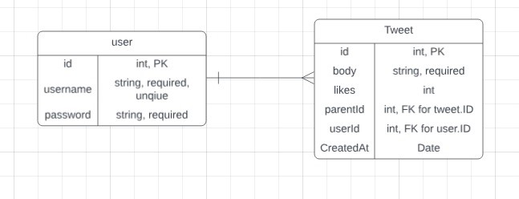

# Social Media APP - Backend API

## Overview
This project is a backend API for a Social Media application where users can create accounts and post tweets. The focus is on building a functional backend using **ASP.NET Core Web API** and **SQL Server**.

## Features
- Create and retrieve users.
- Post, retrieve, like, and reply to tweets.
- Delete tweets.

## Tech Stack
- **Backend**: ASP.NET Core Web API, Entity Framework Core, C#, LINQ.
- **Database**: SQL Server (using Docker).
- **Testing**: xUnit.

